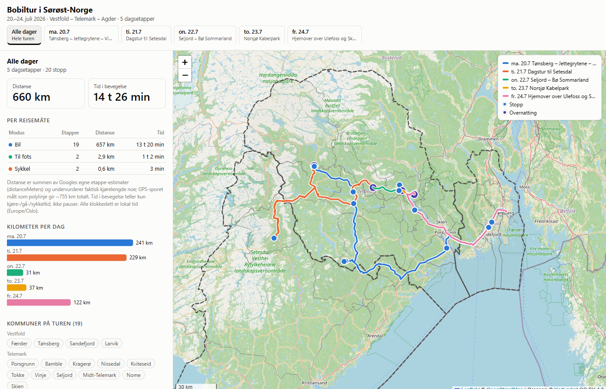

# Bobiltur i Sørøst-Norge · 20.–24. juli 2026

Interactive single-page map of a five-day motorhome trip through Vestfold,
Telemark and Agder in south-eastern Norway, built from a sanitized Google
Timeline export.

**Live app:** <https://laffs2k5.github.io/bobil-tur-sommer-26/>



## What it shows

- **Five day tracks** in fixed per-day colors with a legend. Track geometry is
  drawn from the globally time-sorted GPS points and **split at sampling
  dropouts** (a >10 min hole with real displacement, or an implausibly long
  jump), so gaps are never bridged by straight lines.
- **20 stops** with popups: label, municipality, local arrival/departure
  times, and duration. The four **overnight stops** (850–1250 min) get a
  distinct violet marker. Stops with `name_verified: true` link to Google
  Maps via their place ID; the eight unverified labels are presented as
  approximate locality descriptions with **no link**, per the dataset rules.
- **Day filter**: "Alle dager" plus each date with its dataset title (e.g.
  *Dagstur til Setesdal*). It filters tracks, stops, statistics, charts and
  the municipality list.
- **Statistics**: distance and time in motion, total and per travel mode
  (car / walking / cycling), for the whole trip or the selected day.
- **Administrative context**: borders and names for the 19 municipalities and
  3 counties the trip touches, bundled as static simplified GeoJSON — no
  runtime boundary-API calls.

### Derived insights (and why these)

1. **Stop-duration chart** — 20 stops span 8 minutes to 20+ hours; a sorted
   bar chart with the overnight band highlighted makes the trip's rhythm
   (short errands vs. campsite nights) visible at a glance.
2. **Distance per day chart** — the trip is asymmetric (two ~240 km travel
   days, then short local days); one bar per day in the day's map color ties
   the panel to the map.
3. **Per-leg average speed table** — `distanceMeters` ÷ moving time per
   activity leg, split by mode; it shows motorway legs (~90–110 km/t) vs.
   mountain-road legs, and doubles as the accessible table view of the data.
4. **Municipalities crossed per day** — the dataset records the crossing
   order per day; chips in travel order complement the boundary layer.

A time-of-day scrubber was considered and skipped: sampling is only every
1–6 minutes with long dropouts, so scrubbing would interpolate exactly where
the dataset warns not to.

## Data & metrics

The dataset is a sanitized extract of a personal Google Timeline export —
see [`raw/DATASET.md`](raw/DATASET.md) for the full schema, gotchas, and
privacy rules (which this app follows exactly: no raw-export data, no
reverse-geocoding of endpoints, no personal identifiers).

- Map geometry comes from `raw/trip_20260720_20260724.geojson`.
- All metrics are aggregated from the `activity` segments in
  `raw/trip_20260720_20260724_timeline.json` — **not** from polyline lengths.
- **Distance measure (deliberate choice):** the app publishes Google's own
  per-leg `distanceMeters` sums (**660 km** total; 657 km by car). The traced
  polyline measures ~755 km and both undercount the real road distance; the
  Google figure was chosen because it is the only measure that decomposes
  per leg and per mode consistently. A footnote in the UI states this.
- **Durations** are exact per-leg `endTime − startTime` sums. The per-mode
  values match the reference table in `DATASET.md` (13 t 20 min car,
  1 t 02 min walking, 3 min cycling). The app's total shows **14 t 26 min**;
  the dataset table's "14 h 24 min" is the same sum rounded to a tenth of an
  hour (14.4 h), a rounding artifact documented here rather than reproduced.
- **Timestamps** are Europe/Oslo (`+02:00`) and are rendered from the ISO
  strings' wall-time parts directly — the viewer's timezone can never shift
  them, and UTC is never assumed.

### Administrative boundaries

Municipality (19) and county (3) boundaries were fetched **once** from
Kartverket's open kommuneinfo API on Geonorge (2024 boundaries, matching the
dataset), simplified with Douglas-Peucker, and committed under
`public/data/`. Regenerate with `npm run fetch-boundaries`.

> Boundary data © [Kartverket](https://www.kartverket.no), licensed
> [CC BY 4.0](https://creativecommons.org/licenses/by/4.0/), via
> [ws.geonorge.no/kommuneinfo](https://ws.geonorge.no/kommuneinfo/v1/).
> Base map © [OpenStreetMap](https://www.openstreetmap.org/copyright)
> contributors.

## Why Leaflet

Leaflet over MapLibre GL: the app draws a few hundred vector points over
raster tiles — no vector-tile styling, no 3D, no WebGL needs. Leaflet is
mature, small (~42 kB gzipped), renders overlays as plain SVG (easy to test
and style), and degrades gracefully on low-end Android hardware. MapLibre
would add a WebGL dependency and a bigger bundle for no feature this app
uses.

## Development

```bash
npm install
npm run dev              # dev server
npm run lint             # eslint
npm run test             # unit tests (vitest)
npm run test:coverage    # unit tests + coverage gate (90% overall, ~100% data layer)
npm run build            # type-check + production build to dist/
npm run test:e2e         # Playwright E2E: Chromium+Firefox, desktop+mobile
                         # (first time: npx playwright install chromium firefox)
```

The E2E suite captures screenshots of every major state to
`tests/e2e/screenshots/` (uploaded as CI artifacts).

## CI/CD

`.github/workflows/ci.yml` runs on every push to `main`:
install → lint → unit tests with coverage gate → build → Playwright E2E
(Chromium + Firefox, desktop + Pixel-class mobile viewports) → deploy to
GitHub Pages. The deploy step only runs when every prior step passed.
Screenshots, the Playwright report and the coverage report are uploaded as
workflow artifacts.

## Architecture

- **Data layer** (`src/data/`): pure TypeScript — degree-string coordinate
  parsing, global sorting of unsorted path segments, GPS-gap splitting,
  visit dedup by `hierarchyLevel`, per-mode/per-day aggregation. ~100%
  unit-test coverage, cross-checked against the GeoJSON and the reference
  totals in `DATASET.md`.
- **View helpers** (`src/lib/`): formatting (Norwegian locale, wall-time
  rendering), SVG chart builders, popup HTML — all pure and unit-tested.
- **UI glue** (`src/ui/`, `src/main.ts`): thin Leaflet/DOM wiring, covered
  by the E2E suite rather than unit tests.

## License

Code: [MIT](LICENSE). Trip data (`raw/`): published for this project; see
`raw/DATASET.md` for provenance and redaction rules. Boundary data:
© Kartverket, CC BY 4.0. Base map tiles: © OpenStreetMap contributors.
